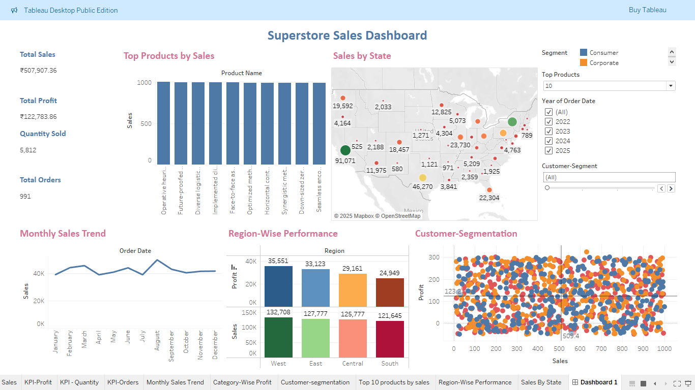

# 📊 Superstore Sales Dashboard in Tableau

## 🎯 Business Goal
To build an interactive Tableau dashboard for Superstore data that enables business users to explore sales trends, customer segments, and regional performance. The aim is to support quick, visual-driven decisions for boosting profitability and operational efficiency.

---

## ❓ Key Questions Answered

What are the total sales, profit, quantity sold, and number of orders?

Which products are generating the highest sales?

How is the sales performance distributed across different states and regions?

How do monthly sales trends fluctuate over the year?

Which regions are contributing the most to overall profit and sales?

How do customer segments differ in terms of sales and profitability?

---

## 🛠️ Steps Involved

1. Data Connection & Cleaning

Connected the cleaned Superstore dataset exported from SQL.

Ensured correct data types for dates, numerical fields, and categorical variables.

2. KPI Cards

Displayed total metrics using aggregated fields:

Total Sales

Total Profit

Quantity Sold

Total Orders

3. Top Products by Sales

Bar chart showing top 10 products based on total sales.

Added a parameter to dynamically control how many top products to show.

4. Sales by State (Map View)

Used a filled map to visualize sales across U.S. states.

Added profit and sales labels directly on the map for better readability.

Color-coded by performance (Red for low, Green for high).

5. Monthly Sales Trend

Line chart displaying monthly sales over time.

Used date parts (Month) to aggregate sales by month.

6. Region-Wise Performance

Bar charts showing:

Total sales by region

Total profit by region

Color-coded to show differences clearly across regions.

7. Customer Segmentation

Scatter plot comparing Sales vs Profit for each customer.

Color-coded by Segment (Consumer, Corporate, Home Office).

Added filters and highlighters for interactive segmentation analysis.

8. Interactivity

Added actions(4 Filter and 1 Highlight)  

Segment filter (to filter all charts by customer segment)

Year filter (to view metrics year-wise)

Top N products parameter (to dynamically change chart based on product count)

---
## Superstore Sales Dashboard 

## 🔍 Key Insights

💸 High Sales but Low Profit: States like California and New York contribute significantly to sales but may have thin margins in some categories.

🏆 Top Products: Certain office supplies and technology items consistently top the sales chart, making them key drivers of revenue.

📉 Profit Variability: Some regions like the South show lower profitability despite decent sales volume — potential cost or discount issues.

📅 Seasonal Trends: Sales peak during mid-year months (e.g., July and August), suggesting promotional campaigns or seasonal demand.

👥 Customer Distribution: Most profitable customers are clustered in the higher sales range but vary widely in segment and region.

📍 Underperforming Areas: Some states like Texas or Illinois show room for improvement either in profit or sales, depending on trends.

--- 

## 🧰 Tools & Skills Used

- Tableau Desktop (Public Edition)
- KPI Visualization
- Filters, Parameters, Dashboard Actions
- Map and Scatter Plot Visuals
- Interactive Dashboard Design

